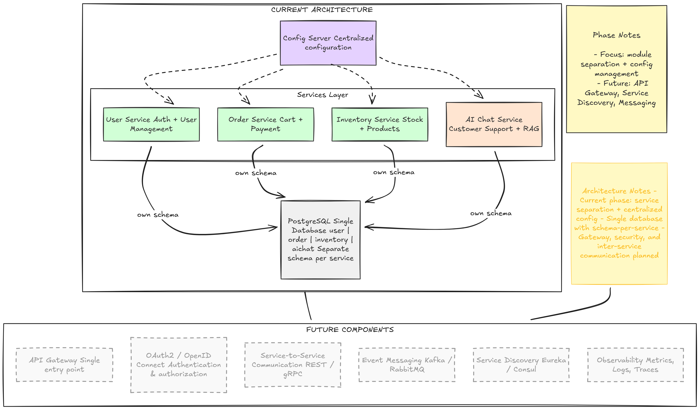

# Microservices E-Commerce Platform (inprogress)

A microservices-based e-commerce platform built with Spring Boot and Java 21.

## Architecture

This project consists of the following microservices till now:

- **User Service** - User management and authentication
- **Order Service** - Order processing and management
- **Inventory Service** - Product inventory management
- **AI Chat Service** - AI-powered customer support
- **Config Server** - Centralized configuration management



## Tech Stack

- **Backend**: Spring Boot 3.5.9, Java 21
- **Database**: PostgreSQL 16
- **Vector Database**: Qdrant
- **Database Admin**: pgAdmin 4
- **Containerization**: Docker & Docker Compose

## Prerequisites

- Java 21
- Maven
- Docker & Docker Compose

## Getting Started

### 1. Start Infrastructure Services

Launch PostgreSQL, Qdrant, and pgAdmin:

```bash
docker-compose up -d
```

This will start:
- PostgreSQL on port `5432`
- Qdrant Vector DB on ports `6333` (HTTP) and `6334` (gRPC)
- pgAdmin on port `5050`

### 2. Database Access

**PostgreSQL:**
- Host: `localhost:5432`
- User: `micro_ecom_user`
- Password: `micro_ecom_password`

**pgAdmin:**
- URL: http://localhost:5050
- Email: `admin@example.com`
- Password: `admin123`

### 3. Build and Run Services

Build each microservice:

```bash
cd user && mvn clean install
cd ../order && mvn clean install
cd ../inventory && mvn clean install
cd ../aichat && mvn clean install
cd ../config-server && mvn clean install
```

Run each service:

```bash
cd user && mvn spring-boot:run
cd order && mvn spring-boot:run
cd inventory && mvn spring-boot:run
cd aichat && mvn spring-boot:run
cd config-server && mvn spring-boot:run
```

## Project Structure

```
microservices-e-commerce/
├── aichat/              # AI Chat microservice
├── config-server/       # Configuration server
├── inventory/           # Inventory management service
├── order/               # Order processing service
├── user/                # User management service
├── product_images/      # Product images storage
├── docker-compose.yml   # Docker infrastructure setup
└── init-db.sql          # Database initialization script
```

## Services Overview

### User Service
Handles user registration, authentication, and profile management.

### Order Service
Manages order creation, processing, payment and tracking.

### Inventory Service
Tracks product stock levels and availability.

### AI Chat Service
Provides AI-powered customer support using vector search with Qdrant.

### Config Server
Centralized configuration management for all microservices.

## Development

Each microservice is independently deployable and follows Spring Boot best practices.

